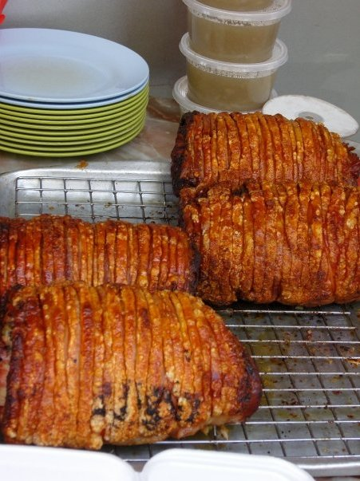

<!-- Main -->

<!-- One -->
<section id="one">
	

		<header class="major">
			<h2>Janice Who?</h2>
			</header>
		
Her written work can be found in publications such as the South China Morning Post, AFAR, New York Times, Monocle, Wall Street Journal, Australian Gourmet Traveller, Discovery Magazine (Cathay Pacific), eater.com, and more. She started her career in food writing first at a community magazine in Melbourne, then in Hong Kong at LUXE City Guides.

	

</section>

<!-- Two -->
<section id="two" class="spotlights">
	<section>
		
		

			

				<header class="major">
					<h3>Tong Chong Street Market</h3>
				</header>
				
Under her food sustainability platform&nbsp;<a href="http://honestlygreen.hk/" target="_blank"><b>Honestly Green</b></a>, in late 2015, she launched a food-focused farmers market,&nbsp;<a href="http://tongchongstreetmarket.com/" target="_blank"><b>Tong Chong Street Market</b></a>, co-presented with Swire Properties, and in 2017, Honestly Green launched <b>Poho Market</b>. 
 
The markets grew from her 2012 project, Island East Markets, which was the largest urban farmers' &nbsp;market in the city, and showcased artisanal products that were locally and responsibly made and grown. 

				
			

		

	</section>
	<section>
		
		

			

				<header class="major">
					<h3>"Inspiring Homegrown Entrepreneur"</h3>
				</header>
				
For her efforts towards food sustainability, she was named <blockquote>"Inspiring Homegrown Entrepreneur"</blockquote> in the inaugural <b>Women of Hope</b> awards and made part of <b>Generation T</b> by <a href="http://hk.dining.asiatatler.com/features/generationt-fb-names-disrupting-the-dining-scene#slide-1" target="_blank"><b>Hong Kong Tatler</b></a>. 

			

		

	</section>
	<section>
		
		

			

				<header class="major">
					<h3>Bevarage awards, lists and guides</h3>
				</header>
				
Janice judges and contributes to major local and international food &amp; beverage awards, lists and guides, and speaks and moderates on panels regarding the food &amp; beverage industry, sustainability, lifestyle media and social entrepreneurship. As senior director of&nbsp;<a href="http://www.littleadventuresinhongkong.com/" target="_blank"><b>Little Adventures in Hong Kong</b></a>, she designs and leads custom food and culture experiences. 

				<ul class="actions">
					<li><a href="generic.html" class="button">Learn more</a></li>
				</ul>
			

		

	</section>
</section>

<!-- Three -->
<section id="three">
	

		<header class="major">
			<h2>Massa libero</h2>
		</header>
		
Nullam et orci eu lorem consequat tincidunt vivamus et sagittis libero. Mauris aliquet magna magna sed nunc rhoncus pharetra. Pellentesque condimentum sem. In efficitur ligula tate urna. Maecenas laoreet massa vel lacinia pellentesque lorem ipsum dolor. Nullam et orci eu lorem consequat tincidunt. Vivamus et sagittis libero. Mauris aliquet magna magna sed nunc rhoncus amet pharetra et feugiat tempus.

		<ul class="actions">
			<li><a href="generic.html" class="button next">Get Started</a></li>
		</ul>
	

</section>

