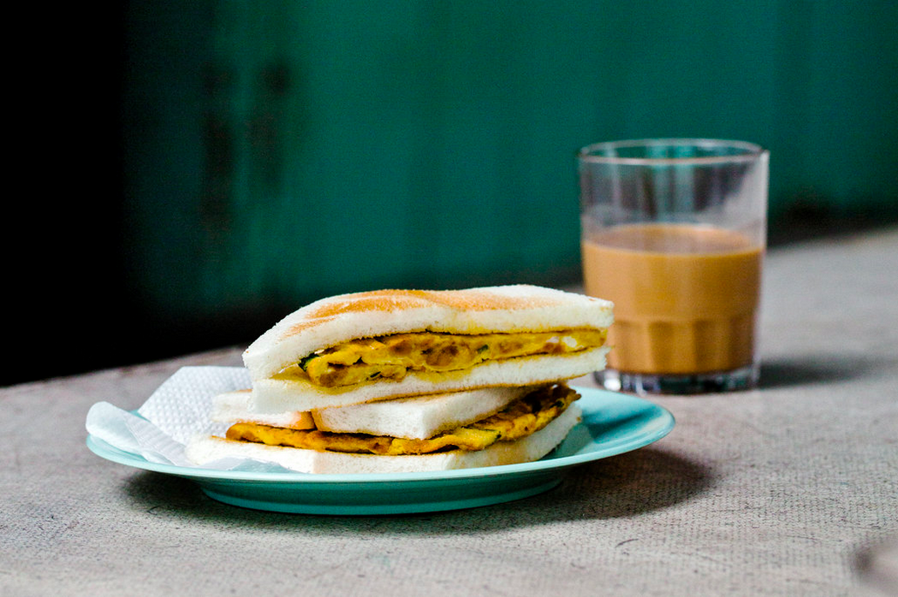

<!-- Main --> 

<!-- One --> <section id="one"> 
 <header class="major"> <h2>Selected Clips</h2> </header> 
<i><a href="http://www.nytimes.com/interactive/2015/02/18/travel/In-Asia-Tastes-of-the-Sea.html?ref=travel" target="_blank">New York Times - In Asia, Tastes of the Sea</a> (Photo by Amanda Kho)</i> 
 
 <ul class="alt"> <h4>Eater</h4> <li><a href="http://www.eater.com/maps/best-hong-kong-restaurants" target="_blank">The 38 Essential Hong Kong Restaurants</a></li> <li>Eater Explains: <a href="https://www.eater.com/2017/7/7/15928320/hong-kong-bubble-waffle-egglet-gai-daan-zai-ice-cream" target="_blank">All About Hong Kong's "Bubble Waffle"</a></li> <li><i>Eater Hong Kong Heat Map</i>, eater.com, <a href="http://eater.com/archives/2012/01/09/the-eater-hong-kong-heat-map-where-to-eat-right-now.php" target="_blank">January 2012</a> to <a href="http://www.eater.com/maps/best-new-restaurants-hong-kong" target="_blank">March 2016</a> (ongoing)</li>

<h4>New York Times</h4> <li><a href="http://www.nytimes.com/interactive/2015/02/18/travel/In-Asia-Tastes-of-the-Sea.html?ref=travel" target="_blank">In Asia, Tastes of the Sea</a> (Hong Kong section)</li>

<h4>Condé Nast Traveler</h4> <a href="https://www.cntraveler.com/destinations/hong-kong" target="_blank">Hong Kong Guide</a> - various sections: <a href="https://www.cntraveler.com/gallery/best-shops-in-hong-kong" target="_blank">shops</a>, <a href="https://www.cntraveler.com/gallery/best-dim-sum-in-hong-kong" target="_blank">dim sum</a>, <a href="https://www.cntraveler.com/gallery/best-markets-in-hong-kong" target="_blank">markets</a>, <a href="https://www.cntraveler.com/gallery/best-hotel-brunch-buffets-in-hong-kong" target="_blank">brunch buffets</a>, <a href="https://www.cntraveler.com/gallery/best-things-to-do-in-hong-kong" target="_blank">things to do</a>.  

<h4>Travel + Leisure (US)</h4> <li><a href="http://www.travelandleisure.com/slideshows/tls-best-new-restaurants-2015-edition/7" target="_blank">The Best New Restaurants (Hong Kong)</a></li>

<h4>Travel + Leisure (Southeast Asia)</h4> <li><a href="https://issuu.com/travelandleisure/docs/t_l_december_zinio_lr_b0eaf4caaabc87/78" target="_blank">The Best of 2017 (Hong Kong)</a></li>

<h4>Australian Gourmet Traveller</h4> <li><a href="http://www.gourmettraveller.com.au/the-disappearing-dishes-of-hong-kong.htm" target="_blank">The Disappearing Dishes of Hong Kong</a></li> </ul> 
 
 <ul class="alt">

<h4>Hong Kong Tatler Dining</h4> <li><a href="https://hk.asiatatler.com/dining/slow-food-cantonese-style" target="_blank">How Foshan's 102 House Is Reframing Cantonese Cuisine</a></li> <li><a href="https://hk.asiatatler.com/dining/a-food-lovers-guide-to-palermo" target="_blank">A Food Lover's Guide to Palermo</a></li> <li><a href="https://hk.asiatatler.com/dining/a-food-lover-s-guide-to-washington-d-c" target="_blank">A Food Lover's Guide to Washington D.C.</a></li> <li><a href="https://hk.asiatatler.com/dining/a-food-lovers-guide-to-okinawa" target="_blank">A Food Lover's Guide to Okinawa</a></li> <li><a href="http://hk.dining.asiatatler.com/features/why-tbilisi-should-be-your-next-destination-for-food-and-wine#slide-1" target="_blank">Why Tbilisi should be your next destination for food and wine</a></li> <li>Dining reviews, e.g. <a href="http://hk.dining.asiatatler.com/restaurants/yee-tung-he42" target="_blank">Man Wah</a>, <a href="http://hk.dining.asiatatler.com/restaurants/tim-s-kitchen-elements" target="_blank">Tim's Kitchen</a></li>

<h4>Michelin Guide</h4> <li><a href="https://guide.michelin.sg/the-first-day-i-got-my-michelin-stars-chan-yan-tak-of-lung-king-heen" target="_blank">The First Day I Got My Michelin Stars: Chan Yan-Tak of Lung King Heen</a></li>

 <h4>AFAR</h4> <li><a href="https://www.afar.com/magazine/beyond-tokyo-exploring-okinawa-the-hawaii-of-japan" target="_blank">Beyond Tokyo: Exploring Okinawa, the Hawaii of Japan</a></li> <li><a href="http://www.afar.com/travel-tips/how-to-eat-along-hong-kongs-subway-stops" target="_blank">How to Eat Along Hong Kong's Subway Stops</a></li> <li><a href="http://www.afar.com/magazine/meet-the-mastermind-behind-hong-kongs-hottest-restaurants" target="_blank">Meet the Mastermind Behind Hong Kong's Hottest Restaurants</a></li>

<h4>South China Morning Post Post Magazine</h4> <li>Culinary Journeys - Chinese influence on <a href="http://www.scmp.com/magazines/post-magazine/food-drink/article/2005548/why-some-nagasakis-iconic-dishes-have-chinese" target="_blank">Nagasaki's champon and shippoku</a></li> <li>Q&A - <a href="http://www.scmp.com/magazines/post-magazine/food-drink/article/2019321/why-legendary-tokyo-bars-mixologist-owner-doesnt" target="_blank">Hidetsugu Ueno, Bar High Five</a></li> <li>Made in Hong Kong - <a href="http://www.scmp.com/magazines/post-magazine/food-drink/article/1989745/husband-and-wife-behind-hong-kong-craft-beer" target="_blank">Nectar of the Gods: Moonzen</a></li> <li>On Our Shelves - <a href="http://www.scmp.com/magazines/post-magazine/food-drink/article/2088930/we-take-peek-inside-top-hong-kong-italian-chef" target="_blank">Umberto Bombana</a></li> <li><a href="http://www.scmp.com/article/996536/jean-charles-cazes" target="_blank">Q&A: Jean-Charles Cazes of Chateau Lynch Bages</a></li>

<h4>Monocle</h4> <li><a href="https://monocle.com/magazine/the-escapist/2018/paradise-found/" target="_blank">Paradise Found, The Escapist 2018</a></li> <li><a href="https://monocle.com/radio/shows/the-menu/food-neighbourhoods-1/" target="_blank">The Menu, Food Neighbourhoods #1</a> (radio)</li> <li><a href="http://monocle.com/radio/shows/the-urbanist/113/" target="_blank">The Urbanist, episode 113</a> (radio, segment starts 41:49)</li> </ul> 
 
 <ul class="alt">

<h4>South China Morning Post</h4> <li><a href="http://www.scmp.com/lifestyle/food-drink/article/2005518/hong-kong-chefs-and-food-impresarios-making-their-mark-globally" target="_blank">Hong Kong restaurateurs making their mark on the world</a></li> <li><a href="http://www.scmp.com/lifestyle/food-drink/article/1982642/hong-kong-drinkers-get-ready-awamori-invasion-okinawa" target="_blank">All about awamori</a>, Okinawa's unique spirit</li> <li><a href="http://www.scmp.com/lifestyle/food-drink/article/1967913/rice-growing-hong-kong-gets-fresh-start-lantau-island" target="_blank">Rice growing in Hong Kong gets a fresh start in Lantau Island</a></li> <li><a href="http://multimedia.scmp.com/wonton-noodles/" target="_blank">Deconstructing wonton noodles</a> </li> <li><a href="http://www.scmp.com/lifestyle/food-drink/article/1863217/two-sisters-open-hong-kongs-first-bean-bar-chocolate-factory" target="_blank">Bean Me Up</a> - Hong Kong's first bean-to-bar chocolate makers</li> <li>Snack Time - <a href="http://www.scmp.com/magazines/48-hours/article/1809090/get-miniature-bowl-wonton-noodles-chee-kei" target="_blank">Chee Kei's "sai yung"</a></li> <li><a href="http://www.scmp.com/magazines/48hrs/article/1483697/hong-kong-restaurants-turning-toward-sustainable-organic-fare" target="_blank">Rise of the Fresh Eaters</a> - Sustainable fine dining in Hong Kong</li> <li><a href="http://www.scmp.com/magazines/48hrs/article/1334610/take-it-mat" target="_blank">Take it to the Mat </a>- Craft beer on the rise in Hong Kong</li> <li><a href="http://www.scmp.com/magazines/48hrs/article/1250599/pop-restaurants-brief-history" target="_blank">Brief Encounters</a> - Pop-up restaurants in Hong Kong, a fad or the future?</li> <li><a href="http://www.scmp.com/magazines/48hrs/article/1226664/dough-it-yourself" target="_blank">Dough it Yourself</a> - Charities supplementing traditional donation income by running their own food businesses</li> <li>25 plus column (over 25 years old) - <a href="http://www.scmp.com/magazines/48hrs/article/1213189/sauce-code" target="_blank">Kowloon Soy Company</a>, <a href="http://www.scmp.com/magazines/48hrs/article/1223888/dai-pai-dongs-history-rich-its-tomato-broth" target="_blank">Sing Heung Yuen dai pai dong</a>, <a href="http://www.scmp.com/magazines/48hrs/article/1324507/la-taverna-hong-kongs-oldest-italian-restaurant-has-kept-its-rustic" target="_blank">La Taverna</a> (Hong Kong's oldest Italian restaurant)</li> <li><a href="http://www.scmp.com/lifestyle/food-wine/article/1103718/feast-meets-west-hong-kong">Open to Persuasion</a> - Chinese chefs with overseas exposure breaking down the boundaries of Cantonese cuisine</li> <li>Legends - <a href="http://www.scmp.com/lifestyle/food-wine/article/1129426/legends-two-stories-behind-xiaolongbao#comments" target="_blank">Two stories behind xiaolongbao</a></li> <li><a href="https://docs.google.com/open?id=0B56_9hXpqnobUDVsdGlTa0M5YXM" target="_blank">Norse code</a> - Nordic cuisine in the eyes of Rasmus Kofoed, gold medalist, Bocuse d'Or 2011 and chef and restaurateur at Geranium, Copenhagen </li> </ul> 
 
 <ul class="alt">

<h4>Wall Street Journal</h4> <li><a href="http://blogs.wsj.com/scene/2012/07/05/savoring-shanghai-in-wan-chai/"  target="_blank">Savor Shanghai in Wan Chai</a> - Zhe Jiang Heen</li> <li><a href="http://blogs.wsj.com/scene/2012/06/13/head-to-macau-for-something-besides-gambling/"  target="_blank">Head to Macau for Something Besides Gambling</a> - Guincho a Galera</li>

<h4>Discovery Magazine (Cathay Pacific)</h4> <li><a href="http://discovery.cathaypacific.com/worlds-best-dishes-lo-hei/" target="_blank">World's Best Dishes: Lo Hei</a></li> <li><a href="http://discovery.cathaypacific.com/hong-kongish-lost-treasures/" target="_blank">Lost Treasure - Hong Kong's Local Seafood</a></li>

<h4>Silkroad (Cathay Dragon)</h4> <li>What Hong Kong is eating right now - 2016's food trends</li>

<h4>NineMSN</h4> <li><a href="http://elsewhere.nine.com.au/2016/04/01/14/31/hong-kong-seven-meals" target="_blank">The seven meals to try in Hong Kong</a></li>

<h4>Marc & Chantal Insights</h4> <li><a href="http://www.marc-chantal.com/insights-post/finding-grandmas-food-in-contemporary-asia" target="_blank">Finding Grandma's Food in Contemporary Asia</a></li> <li><a href="http://www.marc-chantal.com/insights-post/in-search-of-art" target="_blank">In Search of Art, and Oneself</a></li> </ul> 
 
 
 
 </section>

